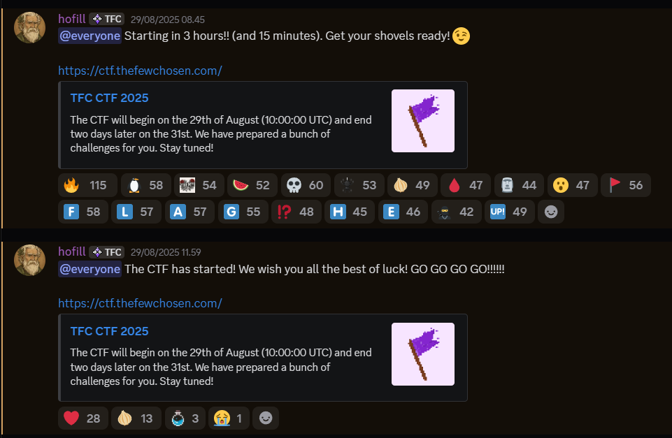
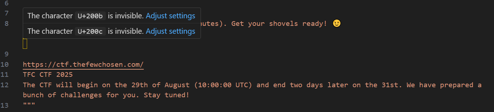

# Discord Shenanigans V5
## Description
The announcement shenanigans are in play again.
As a small hint, maybe bulking up on the nothingness was the best way to hide it. ;) Go get your shovels ready!

Leave the photos alone, man! The flag is not there.

## Exploitation
Given the description it sounds like the flag is hidden in the announcements channel in the discord. Inside the channel we find the following messages:



Given the amount of reactions hinting a flag on the first message we assume its there.

First i wanted to look into the blank space of the picture of a flag. However, the description said it wouldn't be in the pictures so i put that idea on the backburner for now. Because of experience i know the hosts of the events like using reverse psychology, so i don't throw out the idea entirely.

From here i wanted to try and find anything hidden inside the message by converting it to bytes and printing that out. But before i even got there my IDE highlighted invisible characters in the message.



Since there were two different types i thought of converting them to binary and from there converting them to ASCII.

```python
message = """
[...]
"""
data = message.encode()
flag = ""
for b in data:
    if b == 0x8B:
        flag += "1"
    if b == 0x8c:
        flag += "0"

def binary_to_ascii(binary_string):
    ascii_text = ''.join(chr(int(binary_string[i:i+8], 2)) for i in range(0, len(binary_string), 8))
    return ascii_text

print(binary_to_ascii(flag))
```
This returned:

```
¹¼¼«¹
```

Lets try flipping the bits and see if that makes the difference.
This returned the flag:

```
TFCCTF{hidden_shenanigans}
```
