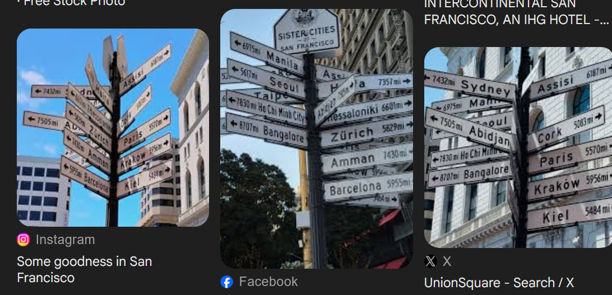
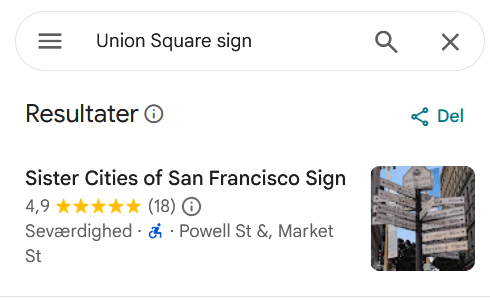

# significant
## Introduction
The signpost knows where it is at all times. It knows this because it knows where it isn't, by subtracting where it is, from where it isn't, or where it isn't, from where it is, whichever is greater. Consequently, the position where it is, is now the position that it wasn't, and it follows that the position where it was, is now the position that it isn't.

Please find the coordinates (lat, long) of this signpost to the nearest 3 decimals, separated by a comma with no space. Ensure that you are rounding and not truncating before you make a ticket. Example flag: ictf{-12.345,6.789}

We get the following:
* [significant.jpg](significant.jpg)

## Investigation
The first thing we do is check the EXIF data of the photo. Since the goal is finding the position where the photo is taken and the EXIF data is easily accesible and can give a precise location.

The EXIF data seems to be wiped from the photo. Next step is looking at it. Doing a reverse image gives us some information.



Since we know the general location -Union Square, San Francisco-, we can find the precise location by prompting google maps.



From here we just use a site to transfer the address to coordinates.

Powell St &, Market St, San Francisco, CA 94102, USA
-> 
Latitude : 37.785011
Longitude : -122.4078282

Formatting of the flag as described in the introduction and it becomes:

```
ictf{37.785,-122.408}
```