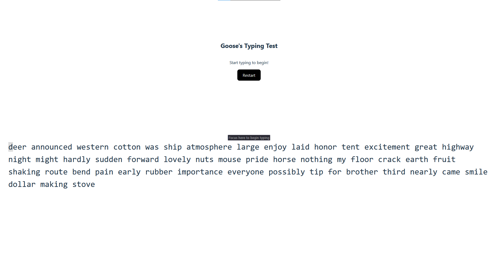

#  gooses-typing-test
## Introduction
Are you a good typer? The Goose challenges you!

We get the following:
* http://challs.watctf.org:3050/

## Investigation
Since its all we are given, we open the site.



Wanting to investigate the site further we take the test. Here we get the following response.

```text
Good job on getting 80 wpm! Next, try to aim for 500 wpm to get a special reward!
```

From hear there are two paths. First, we decide to dive into the javascript and try to circumvent the need to type at the given speed. This can be done by making the code accept all characters, or simply finding the function which runs on completion and giving it a wpm input over 500. However, i am absolutly sure i quite quickly can fix up a [python script that types 500+ wpm](macro.py).

## Exploitation
First we calculate the delay needed between the characters to reach 500 wpm.

```python
cmp = wpm * 6 # Assuming average word length of 5 + 1 space
cps = cmp / 60
delay = 1 / cps
```

From here we use the `pynput`-library to get mouse clicks and press keyboard charactes for us. 

We make the macro start when left mouse is clicked, and make sure it only runs on the first left click. We choose left click because the time starts when we click the input field. However, after testing i discover a slight delay is needed in order for to give the site time to register us clicking the input field.

```python
def on_click(x, y, button, pressed):
    if pressed and str(button) == 'Button.left':
        time.sleep(0.5)  # Accounting for site response to click
        for char in text_to_type:
            keyboard.press(char)
            keyboard.release(char)
            time.sleep(delay)
        # Stop listener
        return False

# Start listening for clicks
with Listener(on_click=on_click) as listener:
    listener.join()
```

Putting it all together we end up with a [python script](macro.py) which can write as fast as the website can compute it.

We copy in the text to write and set the `wpm` to 700 in order to account for the afformentioned delay the site needs to register clicking the input field.

Finaly, we click the input field and get the following reponse.

```text
Wow... you're really fast at typing (572.737686139748 wpm)! Here's your reward:
```

```text
watctf{this_works_in_more_places_than_youd_think}
```
