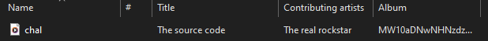

# A Star is Born (misc)
## Introduction
My friend has always dreamed of being a rockstar. Unfortunately, he's always been a poor musician. But do you know what my friend is really good at? Working with AI. He sent me his latest composition and mentioned that he hid a little surprise in it. Can you figure out what he hid?

Flag format: drgn{.*}

## Files
* [chal.mp3](chal.mp3)

## Investigation
When looking at the mp3 in file explorer we see.



The album looks like base64. We take a closer look at the EXIF data but all we find is the base64 album name. So we decode what we got.

```bash
$ echo "MW10aDNwNHNzdzByZA==" | base64 --d
1mth3p4ssw0rd
```

The output could be the flag given the use of numbers as letter which often represents flags. We format the flag as stated in the instructions but get an incorrect message.

Something else must be hinding in the file so lets use `binwalk` to take a look.

```bash
$ binwalk chal.mp3 

DECIMAL       HEXADECIMAL     DESCRIPTION
--------------------------------------------------------------------------------
0             0x0             MP3 ID3 tag, v2.3
3809408       0x3A2080        Zip archive data, encrypted at least v2.0 to extract, compressed size: 521, uncompressed size: 1295, name: lyric.txt
3810091       0x3A232B        End of Zip archive, footer length: 22
```

Looks like we have a hidden zip-file. Lets extract it and use our password `1mth3p4ssw0rd` to see what is inside.

```bash
$ binwalk chal.mp3 -e
[...]
$ ls           
chal.mp3  _chal.mp3.extracted
$ cd _chal.mp3.extracted
$ ls
3A2080.zip
unzip -P 1mth3p4ssw0rd 3A2080.zip 
Archive:  3A2080.zip
  inflating: lyric.txt
```

Now we have [lyric.txt](lyric.txt). Having looked at alot of the other CTF-challenges for this event i know they like to encrypt using rockstar code. So i boot up an [online interpreter](https://codewithrockstar.com/online) and paste it. Running the code returns the following:

```text
100 114 103 110 123 121 48 117 114 101 95 116 104 51 95 114 48 99 107 115 116 97 114 125
```

All the values look to be in the range of the ASCII character set 32-126. We cold construct a short python script but choose to just use the `From Decimal` operation on [cyberchef](https://gchq.github.io/CyberChef/) for the [conversion](https://gchq.github.io/CyberChef/#recipe=From_Decimal('Space',false)&input=MTAwIDExNCAxMDMgMTEwIDEyMyAxMjEgNDggMTE3IDExNCAxMDEgOTUgMTE2IDEwNCA1MSA5NSAxMTQgNDggOTkgMTA3IDExNSAxMTYgOTcgMTE0IDEyNQ). 


## Flag
<details>
<summary>Click to reveal the flag</summary>

```text
drgn{y0ure_th3_r0ckstar}
```