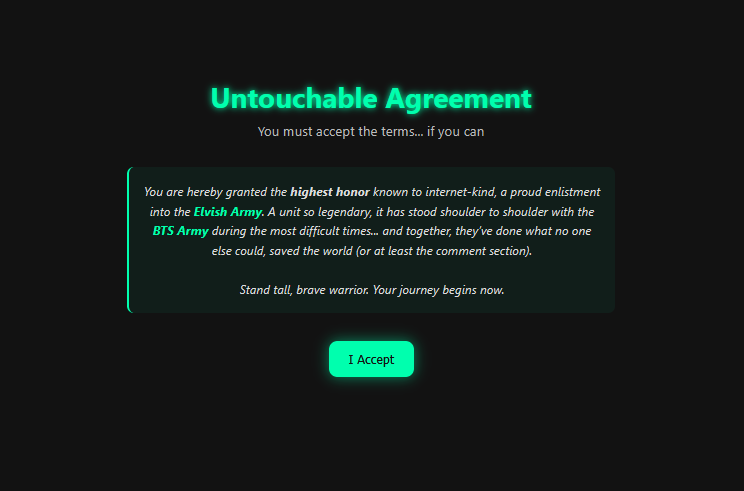
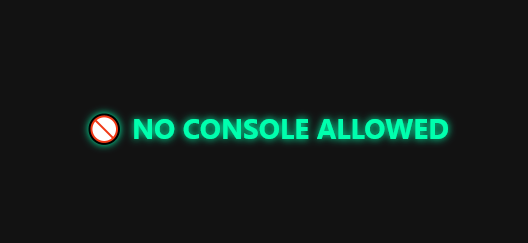

#  The Agreement (web)
## Introduction
Please accept the agreement.

Note: Please switch the flag format from flag{} to 07CTF{}.

We get the following:
* https://elvisharmyontop.netlify.app

## Investigation
Since all we get is a website, lets visit it.





The button moves away from the mouse whenever it gets close. The speed seems to go up exponentially as the mouse gets closer.

The first thing to try is clicking the button using the console. But when we press F12 the site changes to the following.



The body of the HTML for the site also disapears entirely.

I tried reloading the site while in this state which didn't trigger the `NO CONSOLE ALLOWED` site. So, the site does not check if the console is already up, but just for bringing it up.

## Exploitation
From here we are able to see the HTML for the button.

```html
<button tabindex="-1" id="accept" style="transform: translate(0px);">I Accept</button>
```

So we craft a prompt that triggers a click of the button through the console.

```javascript
document.getElementById("accept").click();
```

The following is displayed underneath the button.

```text
✅ Flag: flag{you_out_smarted_the_UI}
```

We format the flag as described in the intructions.

```text
07CTF{you_out_smarted_the_UI}
```