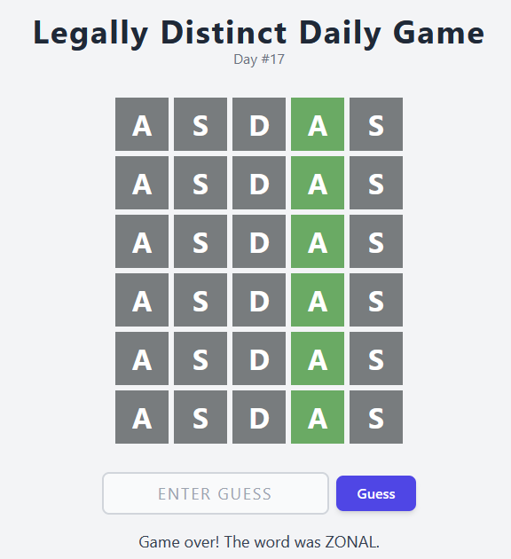

# Daily RE  - Rev & Web
## Introduction
It's too easy to cheat at Wordle, so I fixed that! What are the words for the 72nd, 73rd, and 74th day?

Enter your answer in the format K17{<72nd day word>, <73rd day word>, <74th day word>}. For example if you think the words are 'trace', 'crane', and 'rocks' respectively, enter K17{trace, crane, rocks}.


## Links
* [daily-re.k17.secso.cc](https://daily-re.k17.secso.cc/)

## Investigation
On the website we try to solve the daily puzzle.



Lets see if the words are stored somewhere accessibly to a player.

When inspecting the main thread's js and other code we find that `Debugger > Sources > Main Thread > words.wasm` has [some data](data.txt) on the last line which seem to contain the words.

## Extraction
From here we want to extract the words from the data. We do this by creating a python script.

The words seem to have the same characters just before and after them, that being `\00`. We use this to make a regular expression.

```python
def extract_words(data):
    return re.findall(r"\x00(.{5})\x00", data)
```

Now we just need to iterate through them and print their day in the list.

```python
words = extract_words(data)
for i, word in enumerate(words):
    print(f"{i+1} : {word}")
```

From here we format the flag as specified in the introduction. That being using words 72, 73, and 74.

## Flag
<details>
<summary>Click to reveal the flag</summary>

```text
K17{limbo, urban, fiber}
```