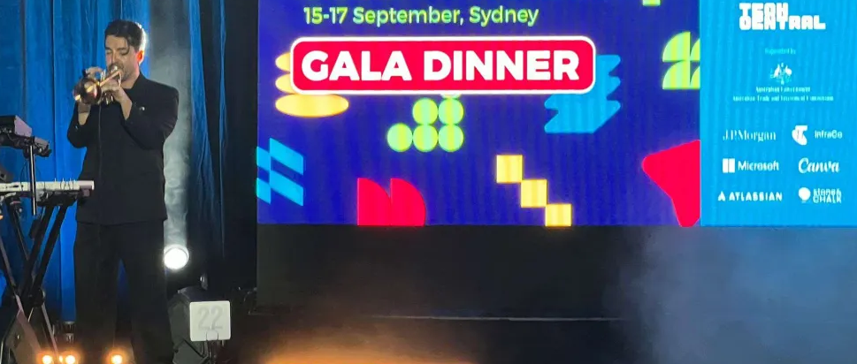

# Dinner - OSINT
## Introduction
foood!!!! fooooood!!!!! what is the name of this venue?!?!!?!? TELL ME

(no need to wrap your answer in the K17 flag format, just enter the name)

## Links
* [location.png](location.png)

## Investigation


We start by doing a reverse image search. This does not return anything useful.

Then lets see if we can create a prompt for a search engine.

`15-17 september sydney gala dinner jp morgan microsoft canva`

Her we find out that [The Tech Council of Australia](https://www.linkedin.com/company/tech-council-of-australia/) has posted about the event on linkedin.

We find a post that contains a [link](https://www.linkedin.com/posts/tech-council-of-australia_national-tech-summit-day-2-activity-7372141989489922049-j7o8/) to the website of the event.

From here we navigate to where event information is displayed: `Events > National Tech Summit 2025 > When + Where`. We then search for dinner on the page and find the only instance where it is mentioned.

```text
DAY 2: INVESTING IN THE FUTURE
[...]
6.45PM-10.30PM: GALA DINNER, CARGO HALL – OVERSEAS PASSENGER TERMINAL
[...]
```

From here we format the flag as specified in the introduction.

## Flag
<details>
<summary>Click to reveal the flag</summary>

```text
Overseas Passenger Terminal
```