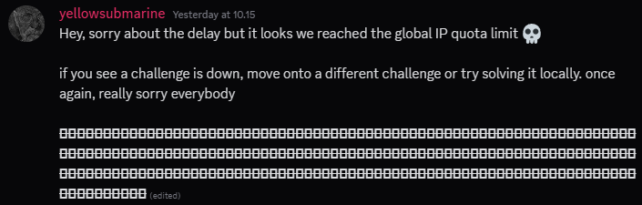
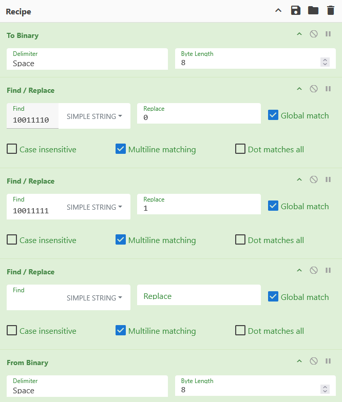

# Discord - Intro
## Introduction
Make sure to join our awesome discord server (https://discord.gg/QeCGUhbjXx) and look in #announcements!

Anyways, here's a random quote:
    "Beware the man who speaks in squares [and semicolons apparently]"

Note: You do not need to open a ticket or send any messages to solve this challenge.

## Investigation
In the announcements channel we find the following message.



These types of challenges are often using different characters -that are sometimes invisible- which you need to extract information from.

So we throw the interesting part of the message into CyberChef and convert it to binary.

```text
10011110 10011111 10011110 10011110 10011111 10011110 10011111 10011111 10011110 10011110 10011111 10011111 10011110 10011110 10011110 10011111 10011110 10011110 10011111 10011111 10011110 10011111 10011111 10011111 [...]
```

From the text we can see that there are two kinds of characters used: `10011110` and `10011111`. This indicates that the characters likely represent binary values.

Inside CyberChef we convert `10011110` to 0, `10011111` to 1, remove spaces, and convert it back from binary.



This outputs the flag.

## Flag
<details>
<summary>Click to reveal the flag</summary>

```text
K17{weLc0m3_t0_k17_C7F!!!}
```