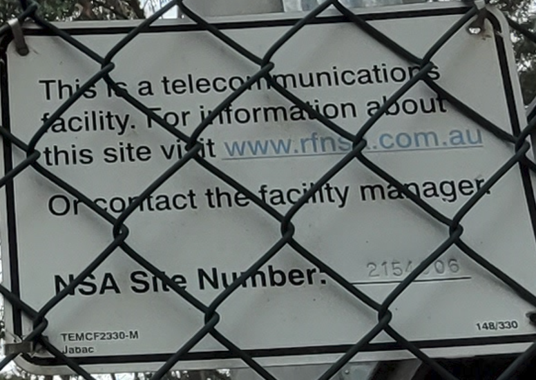
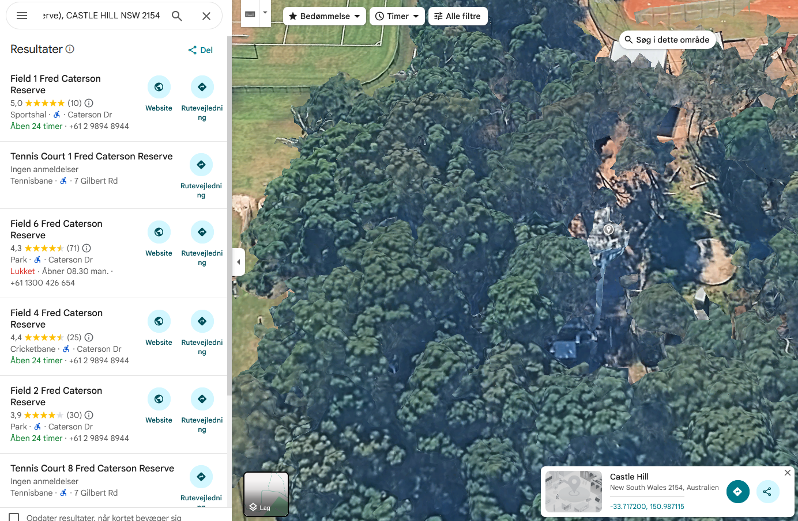

# Radioactive - Osint
## Introduction
Where is this tower located?

Note: Please answer with coordinates rounded to 3 decimal places and wrap your answer with K17{}. For example, if you think that the tower is the Eiffel Tower, please submit K17{48.858,2.296}.

## Files
* [image.jpg](image.jpg)

## Investigation
We can see a sign with info when zooming in.



`https://www.rfnsa.com.au` is the `Radio Frequency National Site Archive` for Australia. Here we can search for the specific site using the site number on the sign. 

There is a single value we cannot see. Since its just a few possibilities we brute force it.

One of the fields on the website is its address:

```text
2154006
Gilbert Road
(East of Field 1 Fred Caterson Reserve),
CASTLE HILL NSW 2154
```

We put this into google maps and select the tower.



We can now see coordinates at the bottom of our screen.

From here we format the flag as specified in the introduction.

## Flag
<details>
<summary>Click to reveal the flag</summary>

```text
K17{-33.717,150.987}
```