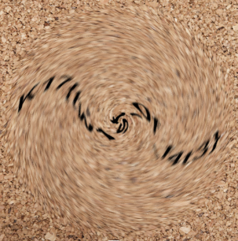

# Smoothie - OSINT
## Introduction
I put the flag in a blender. Oops.

## Files
* [chall.png](chall.png)

## Investigation
Seems straight forward. Find a tool that can swirl and do it in the opposite direction.

We find [onlinejpgtools.com/swirl-jpg](https://onlinejpgtools.com/swirl-jpg) which can not only swirl but also has inputs for radius, angle, and positioning. 

The best combination of inputs was:

```text
Radius :  250
Angle  :  -250
Pos X  :  250
Pos Y  :  250
```



From here we can discern the flag.

## Flag
<details>
<summary>Click to reveal the flag</summary>

```text
K17{tw1st_0f_f4t3}
```