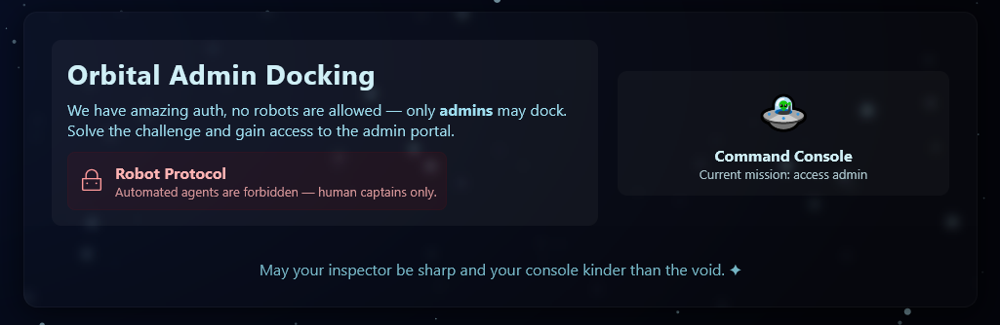
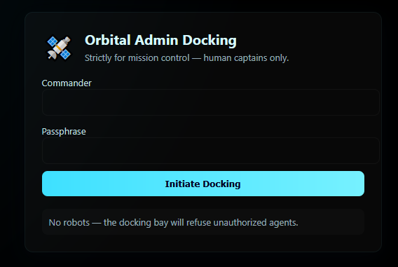

# Lunar Auth  - Web
## Introduction
Infiltrate the LunarAuth admin panel and gain access to the super secret FLAG artifact !

## Links
* [comet.sunshinectf.games](https://comet.sunshinectf.games) 

## Investigation
We search up the website.



Since it talks about robot restrictions, lets look at `/robots.txt`.

```text
# tired of these annoying search engine bots scraping the admin panel page logins:

Disallow: /admin
```

We open the `admin` path.



Lets try sending something like `admin` in both fields. This returns an alert:

```text
[ Invalid credentials ]
```

Looking into the files stored locally, there is a admin.js file in the browser developer tools. Inside is the next clue:

```js
/*
To reduce load on our servers from the recent space DDOS-ers we have lowered login attempts by using Base64 encoded encryption
("encryption" 💀) on the client side.

TODO: implement proper encryption.
*/
const real_username = atob("YWxpbXVoYW1tYWRzZWN1cmVk");
const real_passwd   = atob("UzNjdXI0X1BAJCR3MFJEIQ==");
```

Parsing the two strings through a [Base64 decoder](https://www.base64decode.org/):

Commander `alimuhammadsecured` and Passphrase `S3cur4_P@$$w0RD!`.

Using these credentials on the [site](https://comet.sunshinectf.games/admin) returns the flag.

## Flag
<details>
<summary>Click to reveal the flag</summary>

```text
sun{cl1ent_s1d3_auth_1s_N3V3R_a_g00d_1d3A_983765367890393232}
```