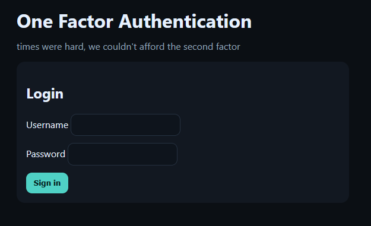
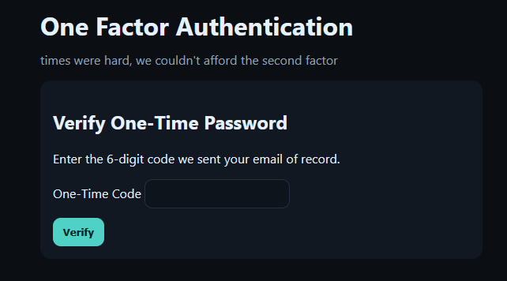

# OFA
## Introduction
Two factors? In this economy??!!

- We are given a temporary website.

## Investigation
The main page displays the following:



We try a random `username` and `password` and get:



No email was provided and the account should not exist. So lets go looking in the debugger and storage for clues.

In the debugger we find a file called otp.

```js
    (function() {
      const REAL = "103248";
      const form = document.getElementById('otp-form');
      const code = document.getElementById('code');

      form.addEventListener('submit', function(e) {
        const val = (code.value || '').trim();
        if (!/^\d{6}$/.test(val)) {
          e.preventDefault();
          alert('Please enter a valid 6 digit code.');
          code.focus();
          return;
        }
        if (val !== REAL) {
          e.preventDefault();
          alert('code does not match ' + REAL);
          code.focus();
        }
      });
    })();
```

Seems like the one time code is always the `103248`. We use this code and get the flag.

## Flag
<details>
<summary>Click to reveal the flag</summary>

```text
flag{013cb9b123afec26b572af5087364081}
```