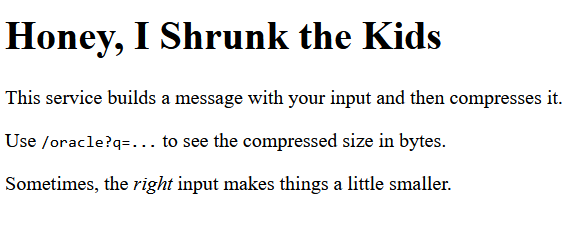

# Misc 100-1 Honey, I Shrunk the Kids
## Introduction
Your mission is to recover the flag from a live service that will happily tell you how well it can compress a message that includes your input. The service does not give you the flag directly — it only tells you the compressed length (in bytes) of an internal message built using your input. Thoughtful inputs produce shorter compressed output; use that signal to reveal the flag.

What the service exposes:
GET / — human landing page (informational). GET /oracle?q= — returns JSON with one field: {"compressed_len": 123} This number is the length in bytes of the gzip compression of the internal message that the server builds.

How the server constructs the message: When you call /oracle?q=... the server assembles a single short UTF-8 string that looks like this (quotes not included): `1session=stable; secret_flag=; note=1` It then compresses that whole string with gzip and reports the compressed length in bytes. Knowing the structure above is important: your input is placed immediately after the secret flag in the same string, so well-chosen inputs can create repeated substrings that the compressor will exploit. 

## Files & Links
- We are given a temporarily accesible website.

## Investigation
Since its a website lets have a look. 



We can use the fact that it is using constant formatting. The fomatting inclueds the flag: `1session=stable; secret_flag=; note=1`. Having the same substring before compression should result in fewer bytes after compression. So we can include the part of the flag we know in our query. 

From here we can guess a single character at at time by trying all possible chars and comparing their compressed lengths. The shortest must be the correct next character since the substrings would overlap. So we add this to our known part of the flag and continue this process until we reach a `}`, marking the end of the flag. 

We create a [python script](solver.py) to compute the flag using this method.

Seems like they have a rate limit. Lets just lower the speed of our requests until its low enough.

Though it took a while, this provides us with the flag.

## Flag
<details>
<summary>Click to reveal the flag</summary>

```text
poctf{uwsp_pr1c3l355_7h0u6h_17_15}
```