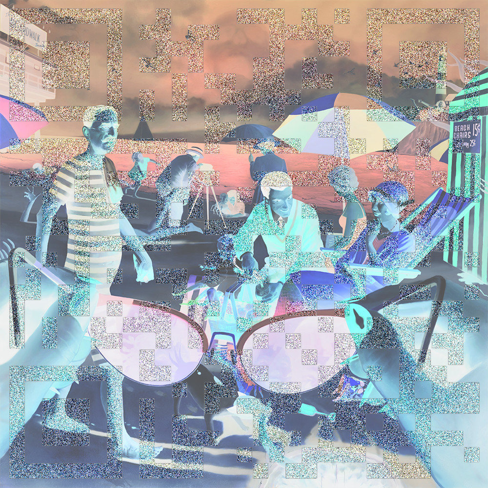
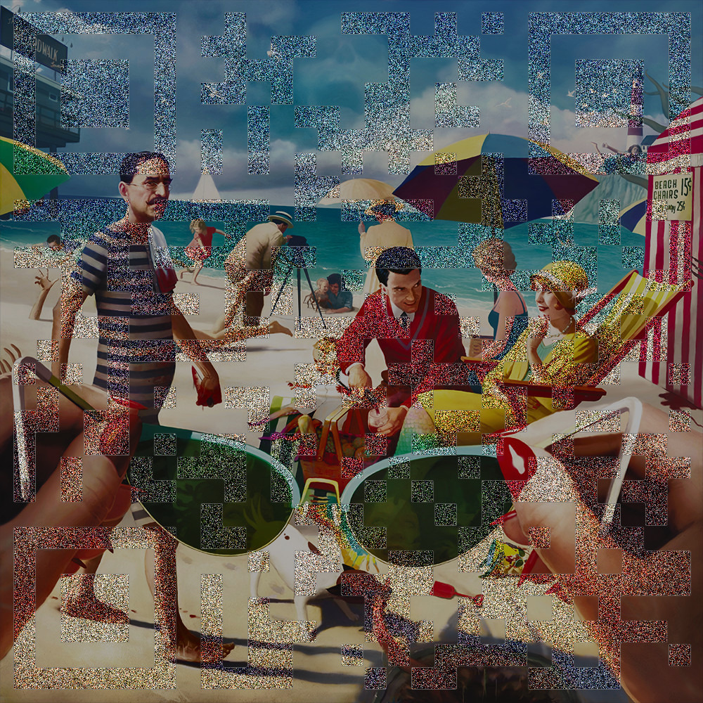
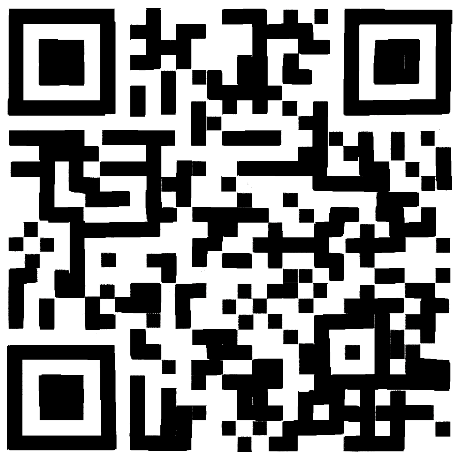

# Stego 100-3 Low Tide at Midnight
## Introduction
In the 2023 contest, we had a stego challenge that utilized an image from Jeff Lee Johnson called "Blue Plate Special." Well, this year we couldn't resist adding some of the Missouri illustrators new work. The trick with this one might be finding a clear way to extract the flag, but if you know then you know. 

## Files
* [stego100-3.jpg](stego100-3.jpg)

## Investigation


Picture seems to be inversed so lets fix that.



Seems like there is a hidden QR-code. A phone can not pick it up. So we need to isolate it.

Lets try using Gimp to find differences between this photo and the original. We find the original online in the same resolution (900x900). From here we make each of them their own layer in Gimp and change the top layer to `differences`. This doesnt seem to work properly.

I believe the afformentioned way was the intended solution. But since it does not work lets take the time to paint in the QR-code ourselves.



Scanning the code provides the flag. This can be done online or using your phone.

## Flag
<details>
<summary>Click to reveal the flag</summary>

```text
poctf{uwsp_f0r3v3r_bl0w1n6_bubbl35}
```