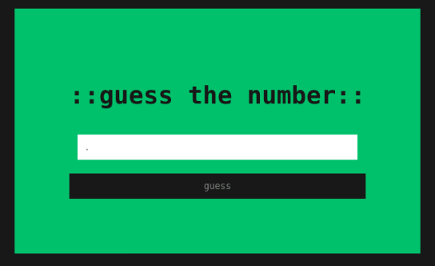

# 1337guesser - Rev
## Introduction
Kan du slå mit "simple" spil? 👾 Hver gang du gætter forkert, vil der blive genereret et nyt nummer. 🙀

- We are given a temporarily accesible website.

## Investigation
We get a website so lets have a look.



We provide a number and get back an alert:

```text
checking.. flag will not be displayed if false
```

The flag doesn't seem to be displayed anywhere.

My first instinct is to find out if the site uses a function or sends a post request to get the number. So, lets go looking in the Debugger and Network inspect tabs for clues.

No POST request can be seen in the Network tab when providing a number.

Inside the Debugger tab we find a file which seems to be the `index` file for the page. In the file is a JS section:

```js
function _0x201b(_0x212891,_0x4755c3){const _0xba2e68=_0xba2e();return _0x201b=function(_0x201bed,_0x195c3f){_0x201bed=_0x201bed-0x103;let _0x20b3fa=_0xba2e68[_0x201bed];return _0x20b3fa;},_0x201b(_0x212891,_0x4755c3);}function _0xba2e(){const _0x31c9d5=['1271130vEUMHI','726NwqEnD','2590929KffKwd','10zgROeg','textContent','1907892RjhURJ','then','floor','json','querySelector','broken:','643748PGTkWr','random','error','747582CXYNGL','flag','11rEjJAg','getElementById','value','10267090tZryet','catch','8rBlUdG','154hWPsOr'];_0xba2e=function(){return _0x31c9d5;};return _0xba2e();}const _0x22a063=_0x201b;(function(_0x142287,_0x5b49a2){const _0x46a970=_0x201b,_0x3821d3=_0x142287();while(!![]){try{const _0x11d434=-parseInt(_0x46a970(0x105))/0x1*(-parseInt(_0x46a970(0x103))/0x2)+-parseInt(_0x46a970(0x112))/0x3+-parseInt(_0x46a970(0x10f))/0x4*(parseInt(_0x46a970(0x107))/0x5)+parseInt(_0x46a970(0x104))/0x6+-parseInt(_0x46a970(0x109))/0x7+-parseInt(_0x46a970(0x119))/0x8*(parseInt(_0x46a970(0x106))/0x9)+parseInt(_0x46a970(0x117))/0xa*(parseInt(_0x46a970(0x114))/0xb);if(_0x11d434===_0x5b49a2)break;else _0x3821d3['push'](_0x3821d3['shift']());}catch(_0x58d7ec){_0x3821d3['push'](_0x3821d3['shift']());}}}(_0xba2e,0x27c91));let _0x69d1d3d37=Math[_0x22a063(0x10b)](Math['random']()*0x3e8)*0x2b;function README(){const _0x49540a=_0x22a063;let _0x32fdb4=parseInt(document[_0x49540a(0x115)]('b')[_0x49540a(0x116)]);_0x32fdb4===_0x69d1d3d37?fetch('/',{'headers':{'X-Requested-With':'XMLHttpRequest'}})[_0x49540a(0x10a)](_0x5d750b=>_0x5d750b[_0x49540a(0x10c)]())[_0x49540a(0x10a)](_0x9a506b=>{const _0x2faaf1=_0x49540a;document[_0x2faaf1(0x10d)]('h1')[_0x2faaf1(0x108)]='::'+_0x9a506b[_0x2faaf1(0x113)];})[_0x49540a(0x118)](_0x4a46f7=>{const _0x53d305=_0x49540a;console[_0x53d305(0x111)](_0x53d305(0x10e),_0x4a46f7);}):alert('checking.. flag will not be displayed if false');_0x69d1d3d37=Math[_0x49540a(0x10b)](Math[_0x49540a(0x110)]()*0x3e8)*0x2b;}document['getElementById']('v')['addEventListener']('click',README);
```

This is unreadable. We beautify it using an online [js beautifier](https://beautifier.io/).

We find the following concerning how the random number is generated:

```js
let _0x69d1d3d37 = Math[_0x22a063(0x10b)](Math['random']() * 0x3e8) * 0x2b;
```

We try `Math[_0x22a063(0x10b)](Math['random']() * 0x3e8) * 0x2b` in the console and get a new number each time.

Lets see if its simply stored inside `_0x69d1d3d37`.

```console
>> _0x69d1d3d37
35475 
```

We provide this number as our guess.

It was correct! The flag is displayed in the middle of the screen.

## Flag
<details>
<summary>Click to reveal the flag</summary>

```text
DDC{1337_d3crypt0r_g0d}
```